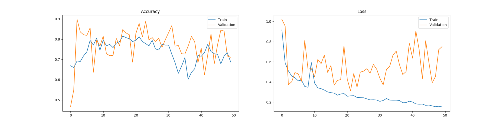

# Training

## 4 classes

|  Class 1   | Class 2 | Class 3 | Class 4 |
| :--------: | :-----: | :-----: | :-----: |
| Bird/Plane | Cat/Car |  Flies  |  Walks  |

- For birds/cats the network sees all 4 classes during training
- For planes/cars the network only sees the first 2 classes during training
- For testing the network gets planes/cars but has to predict the last 2 classes 

### Resnet18 with pretrained=True 50 epochs

- Max test accuracy 0.934
- Min test loss 0.2231

### Resnet18 with pretrained=False 50 epochs

- Max test accuracy 0.922 
- Min test loss 0.2204

## 6 Classes

| Class 1 | Class 2 | Class 3 | Class 4 | Class 5 | Class 6 |
| :-----: | :-----: | :-----: | :-----: | :-----: | :-----: |
|  Plane  |   Car   |  Bird   |   Cat   |  Flies  |  Walks  |

- For birds/cats the network sees all 6 classes during training
- For planes/cars the network only sees the first 4 classes during training
- For testing the network gets planes/cars but has to predict the last 2 classes 

### Resnet18  with pretrained=False 50 epochs

- Max test accuracy 0.898
- Min test loss 0.310

## 6 classes associate between first 4

The idea is that the network sees planes and birds flying and cats and cars on the ground, so it should associate birds with planes and cats with cars.

| Class 1 | Class 2 | Class 3 | Class 4 | Class 5 | Class 6 |
| :-----: | :-----: | :-----: | :-----: | :-----: | :-----: |
|  Plane  |   Car   |  Bird   |   Cat   |  Flies  |  Walks  |

- For birds/cats the network sees all 6 classes during training
- For planes/cars the network only sees the first 6 classes during training
- For testing the network gets planes/cars but has to predict the classes 3 and 4

### Resnet18 with with pretrained=False 50 epochs

- Max test accuracy 0.89
- Min test loss 0.0356

### Resnet18 with with pretrained=True 50 epochs

- Max test accuracy 0.901
- Min test loss 0.0183